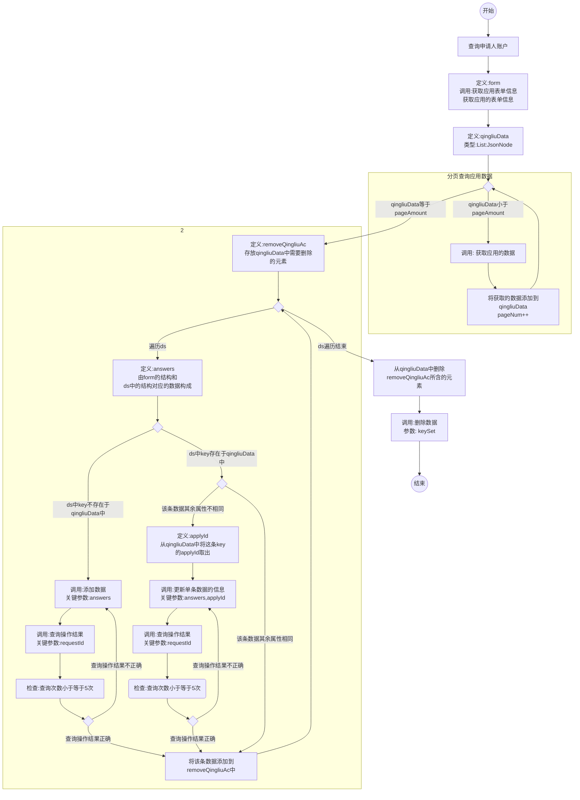

```mermaid
graph TB
开始((开始)) --> 查询申请人账户 -->O[定义:form<br/>调用:获取应用表单信息<br/>获取应用的表单信息] --> P[定义:qingliuData<br/>类型:List:JsonNode] -->判断1{ }

subgraph 分页查询应用数据
判断1{ } --qingliuData小于pageAmount--> B[调用: 获取应用的数据] -->C[将获取的数据添加到qingliuData<br/>pageNum++] --> 判断1{ }
end

subgraph 2
判断1{ } --qingliuData等于pageAmount-->N1[定义:removeQingliuAc<br/>存放qingliuData中需要删除的元素]--> 判断

判断{ } --遍历ds-->N[定义:answers<br/>由form的结构和<br/>ds中的结构对应的数据构成]--> 判断2{ }

判断2{ } --ds中key存在于qingliuData中--> 判断3{ }
判断2{ } --ds中key不存在于qingliuData中-->I[调用:添加数据<br/>关键参数:answers]-->I1[调用:查询操作结果<br/>关键参数:requestId]
I1-->I2[检查:查询次数小于等于5次]-->判断5{ }
判断5{ }--查询操作结果正确-->H
判断5{ }--查询操作结果不正确-->I

判断3{ } --该条数据其余属性不相同-->Q[定义:applyId<br/>从qingliuData中将这条key的applyId取出] --> L[调用:更新单条数据的信息<br/>关键参数:answers,applyId] -->L1[调用:查询操作结果<br/>关键参数:requestId]-->L2(检查:查询次数小于等于5次<br/>)-->判断4{ }

判断4{ }--查询操作结果正确-->H[将该条数据添加到removeQingliuAc中]--> 判断{ }
判断4{ }--查询操作结果不正确-->L
判断3{ } --该条数据其余属性相同-->H
end

判断{ } --ds遍历结束 -->H1[从qingliuData中删除removeQingliuAc所含的元素]-->K

K[调用:删除数据<br/>参数: keySet] --> 结束((结束))


```

